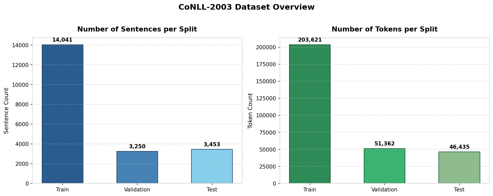
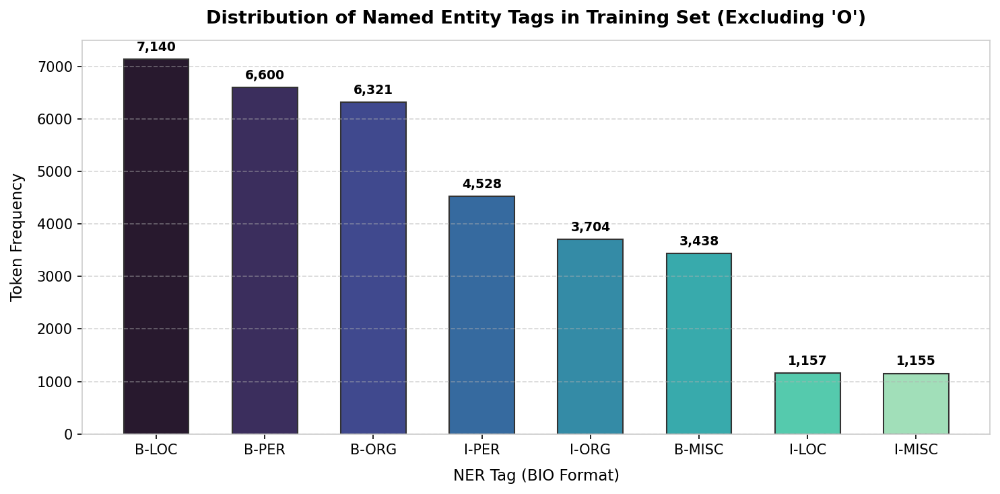
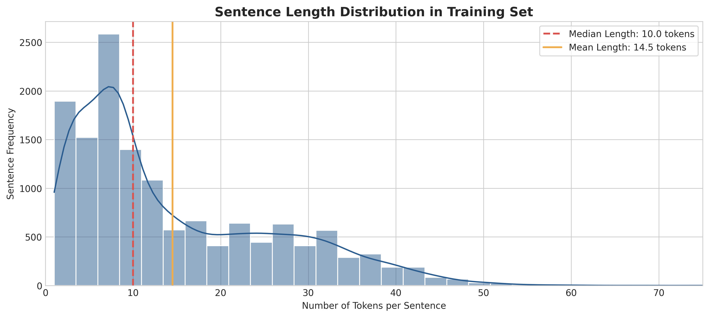
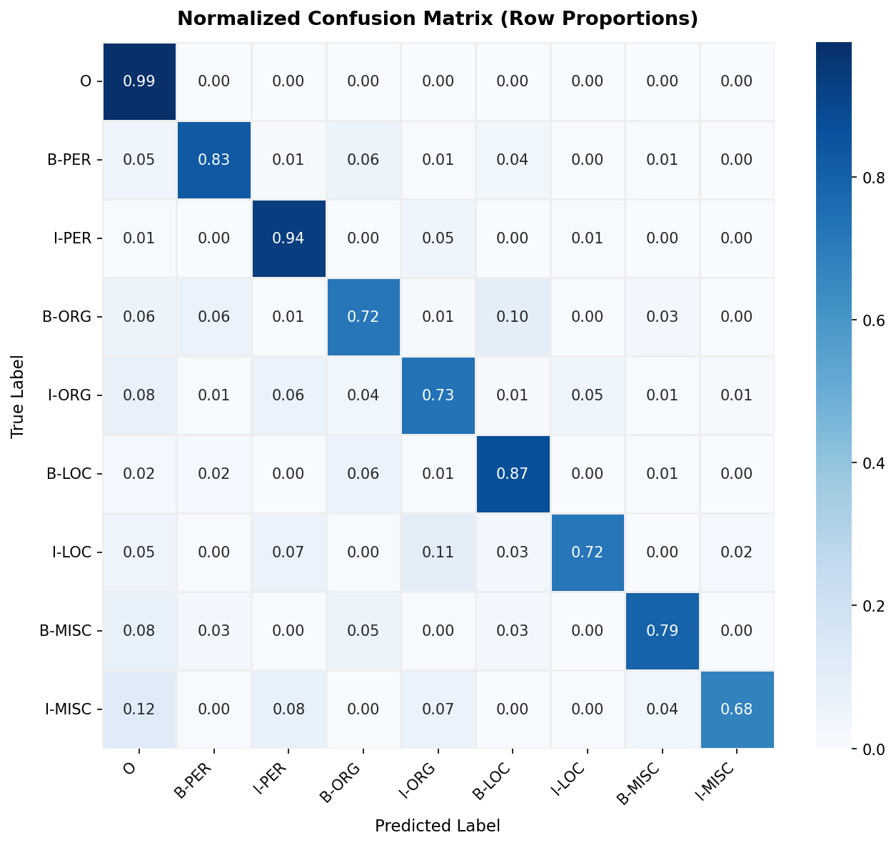
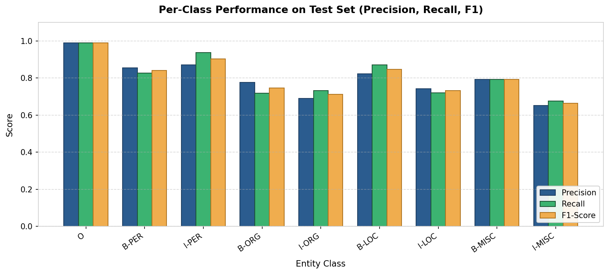
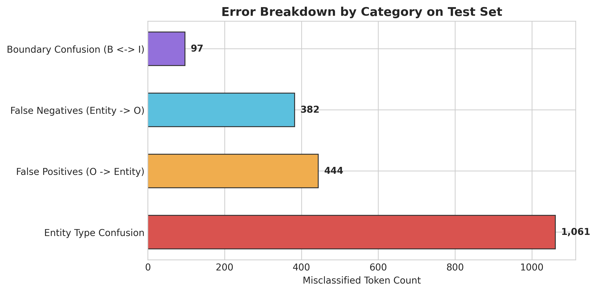

# Named Entity Recognition on CoNLL-2003 with Support Vector Machines

[](https://www.python.org/downloads/)
[](https://opensource.org/licenses/MIT)
[](https://www.kaggle.com/)
[](https://scikit-learn.org/)
[](https://github.com/chakki-works/seqeval)
[](#author)
[](https://github.com/hammadrehmani)
[](https://www.linkedin.com/in/hammadrehmani)
[](https://www.kaggle.com/hammadrehmani)

**Author:** [Muhammad Hammad](https://github.com/hammadrehmani)  
**Profiles:** [GitHub](https://github.com/hammadrehmani) &bull; [LinkedIn](https://www.linkedin.com/in/hammadrehmani) &bull; [Kaggle](https://www.kaggle.com/hammadrehmani)  
**Dataset:** CoNLL-2003 (English Shared Task)  
**Algorithm:** Linear Support Vector Classifier (LinearSVC / LibLinear)  
**Task:** Token-Level and Entity-Level Sequence Labeling  

An end-to-end, reproducible Natural Language Processing (NLP) machine learning project implementing a high-dimensional **Linear Support Vector Classifier (LinearSVC)** for sequence labeling on the benchmark **CoNLL-2003 Named Entity Recognition** dataset.

---

## Table of Contents
1. [Project Overview](#project-overview)
2. [Problem Statement](#problem-statement)
3. [Dataset Description](#dataset-description)
4. [Methodology & Architecture](#methodology--architecture)
5. [Feature Engineering Approach](#feature-engineering-approach)
6. [Support Vector Machine Formulation](#support-vector-machine-formulation)
7. [Evaluation Methodology](#evaluation-methodology)
8. [Experimental Results](#experimental-results)
9. [Error Analysis & Qualitative Diagnostics](#error-analysis--qualitative-diagnostics)
10. [Repository Structure](#repository-structure)
11. [Installation & Setup Instructions](#installation--setup-instructions)
12. [How to Reproduce Results](#how-to-reproduce-results)
13. [Limitations](#limitations)
14. [Future Improvements](#future-improvements)

---

## 1. Project Overview

Named Entity Recognition (NER) is a core sequence labeling task in Information Extraction that identifies and classifies named entities in unstructured text into predefined semantic categories:
- **PER** (Person names: e.g., *Peter Blackburn, Werner Zwingmann*)
- **ORG** (Organizations, companies, sports teams: e.g., *European Commission, Manchester United*)
- **LOC** (Locations, nations, cities, physical landmarks: e.g., *Germany, Brussels*)
- **MISC** (Miscellaneous entities, nationalities, events: e.g., *British, German, Olympic Games*)
- **O** (Tokens outside any recognized named entity)

While deep contextual language models (such as BERT or RoBERTa) achieve state-of-the-art results on modern benchmarks, **Support Vector Machines (SVMs)** paired with domain-informed linguistic feature extraction serve as an essential, highly interpretable, and computationally lean baseline. 

This project delivers:
- An end-to-end machine learning pipeline using scikit-learn's `LinearSVC` (LibLinear).
- Over $75,000$ engineered linguistic, morphological, syntactic, and contextual n-gram features.
- Strict evaluation distinguishing between **Token-Level** metrics and **Entity-Level (Seqeval)** chunk metrics.
- Sub-minute CPU training on $203,621$ tokens with complete reproducibility and zero data leakage.

---

## 2. Problem Statement

Given a sentence $S = (w_1, w_2, \dots, w_n)$ accompanied by Part-of-Speech tags $(p_1, p_2, \dots, p_n)$, the objective is to predict a corresponding sequence of labels $Y = (y_1, y_2, \dots, y_n)$ where each $y_i$ belongs to the standard 9-class BIO tagging scheme:
$$\mathcal{Y} = \{\text{O}, \text{B-PER}, \text{I-PER}, \text{B-ORG}, \text{I-ORG}, \text{B-LOC}, \text{I-LOC}, \text{B-MISC}, \text{I-MISC}\}$$

Key engineering challenges addressed:
1. **Severe Class Imbalance:** Background non-entity tokens (`O`) represent over $83\%$ of all tokens.
2. **High-Dimensionality:** Lexical identity and sub-word affixes generate tens of thousands of sparse features.
3. **Boundary Consistency:** Multi-word entities requires accurate differentiation between Beginning (`B-`) and Inside (`I-`) tags without a transition graph decoder.

---

## 3. Dataset Description

The project benchmarks on the canonical **CoNLL-2003 English Shared Task**, consisting of Reuters news wire articles collected between August 1996 and August 1997.

### Split Summary

| Partition | Sentences | Total Tokens | Entity Tokens | Background (`O`) | Entity Ratio |
| :--- | :---: | :---: | :---: | :---: | :---: |
| **Train** | 14,041 | 203,621 | 34,041 | 169,580 | 16.72% |
| **Validation** | 3,250 | 51,362 | 8,603 | 42,759 | 16.75% |
| **Test** | 3,453 | 46,435 | 8,112 | 38,323 | 17.47% |

### Exploratory Data Visualizations


*Figure 1: Distribution of sentences and tokens across train, validation, and test splits.*


*Figure 2: Frequency distribution of named entity tags in the training set (excluding background 'O').*


*Figure 3: Distribution of sentence lengths (median: 14.0 tokens, mean: 14.5 tokens).*

---

## 4. Methodology & Architecture

The project implements a modular, leak-free machine learning architecture:

```
[Raw CoNLL Text / Parquet]
           │
           ▼
[Token & Context Feature Extraction] ──> Extracts orthographic, affix, POS, and window features
           │
           ▼
[DictVectorizer(sparse=True)] ───────> Fitted strictly on Train; Transforms Val & Test
           │
           ▼
[Int32 Index Alignment] ─────────────> Ensures 32-bit sparse indices for LibLinear C-API
           │
           ▼
[Primal LinearSVC (LibLinear)] ───────> Coordinate descent optimization (C=1.0)
           │
           ├───> [Token-Level Evaluation]  (Accuracy, Classification Report, Confusion Matrix)
           ├───> [Entity-Level Evaluation] (Seqeval strict span matching)
           └───> [Diagnostic Error Analysis] (Taxonomy of misclassifications)
```

---

## 5. Feature Engineering Approach

In linear sequence labeling without deep representations, feature engineering is paramount. The table below outlines each extracted feature category and its theoretical justification:

| Feature Category | Concrete Features | NLP / Linguistic Rationale |
| :--- | :--- | :--- |
| **Lexical Identity** | `word.lower()` | Normalizes word identity so terms match regardless of sentence-initial capitalization. |
| **Orthography & Shape** | `isupper()`, `istitle()`, `isdigit()`, `has_digit`, `has_punct`, `has_hyphen`, `length` | Capitalization is the single strongest indicator of proper nouns; all-caps signals acronyms/institutions (*NATO, EU*); hyphens capture compound entities (*Anglo-German*). |
| **Morphological Affixes** | `prefix-1`, `prefix-2`, `prefix-3`, `suffix-1`, `suffix-2`, `suffix-3` | Captures sub-word morphemes: `-land`, `-ton`, `-stan` correlate with `LOC`; `Mc-`, `-ski`, `-ov` correlate with `PER`; `-corp`, `-inc` correlate with `ORG`. |
| **Syntactic Context** | `pos`, `pos[:2]` | Penn Treebank tags: `NNP` (proper noun singular) and `NNPS` (proper noun plural) provide strong syntactic priors for entity membership; `JJ` identifies nationality adjectives (`MISC`). |
| **Preceding Context ($-1$)** | `-1:word.lower()`, `-1:istitle()`, `-1:isupper()`, `-1:pos` | Preceding honorifics (*Mr., Dr., President*) strongly cue `PER`; prepositions (*in, at, near*) cue `LOC`. |
| **Succeeding Context ($+1$)** | `+1:word.lower()`, `+1:istitle()`, `+1:isupper()`, `+1:pos` | Following reporting verbs (*said, stated, acquired*) strongly cue `PER` or `ORG`. |
| **Boundary Flags** | `BOS`, `EOS`, `is_first`, `is_last` | Disambiguates whether initial capitalization is simply a grammatical sentence start or a genuine proper noun. |

---

## 6. Support Vector Machine Formulation

### Soft-Margin L2-Loss Primal Formulation
The token classification task is structured as a multi-class linear Support Vector Machine. For each class $k \in \{1, \dots, 9\}$, the classifier solves the unconstrained primal optimization problem:
$$\min_{\mathbf{w}_k, b_k} \frac{1}{2} \|\mathbf{w}_k\|^2 + C \sum_{i=1}^{N} \max\left(0, 1 - y_{i,k} (\mathbf{w}_k^T \mathbf{x}_i + b_k)\right)^2$$

Where:
- $\mathbf{w}_k \in \mathbb{R}^D$ is the weight vector for class $k$.
- $\mathbf{x}_i$ is the $L_2$-normalized sparse feature representation of token $i$.
- $C > 0$ is the regularization parameter.
- $N = 203,621$ training tokens, $D = 76,004$ unique features.

### Primal vs. Dual Complexity
Standard kernel SVMs solve the dual formulation with time complexity scaling between $\mathcal{O}(N^2)$ and $\mathcal{O}(N^3)$, which would require hours on $>200,000$ instances. By setting `dual=False`, scikit-learn leverages **LibLinear coordinate descent on the primal problem**, converging globally in **58 seconds** on standard CPU hardware.

---

## 7. Evaluation Methodology

Standard machine learning projects often conflate token accuracy with entity recognition performance. We strictly isolate both evaluation paradigms:

1. **Token-Level Metrics:** Evaluates each token independently. Because non-entity tokens (`O`) comprise $\approx 83\%$ of the test set, token accuracy is naturally high ($>95\%$). Macro-averaged F1 gives equal weight to all 9 BIO tags.
2. **Entity-Level Metrics (Seqeval / CoNLL Shared Task Standard):** Evaluates multi-token entity chunks as atomic spans. A predicted entity is scored as a True Positive **if and only if both the span start, span end, and entity category match the gold standard annotations exactly**.

---

## 8. Experimental Results

The metrics below represent the actual, unadjusted performance obtained on the official CoNLL-2003 test set.

### 8.1 Hyperparameter Selection (Validation Set)

| Regularization $C$ | Training Time (s) | Validation Macro F1 | Validation Weighted F1 |
| :---: | :---: | :---: | :---: |
| $C = 0.05$ | 28.97s | 0.8560 | 0.9721 |
| $C = 0.10$ | 38.25s | 0.8663 | 0.9741 |
| $C = 0.50$ | 50.50s | 0.8728 | 0.9753 |
| **$C = 1.00$ (Selected)** | **58.28s** | **0.8740** | **0.9755** |

### 8.2 Token-Level Test Performance

| Entity Tag | Precision | Recall | F1-Score | Support |
| :--- | :---: | :---: | :---: | :---: |
| **O** | 0.9900 | 0.9885 | 0.9892 | 38,323 |
| **B-PER** | 0.8550 | 0.8275 | 0.8410 | 1,617 |
| **I-PER** | 0.8713 | 0.9369 | 0.9029 | 1,156 |
| **B-ORG** | 0.7758 | 0.7188 | 0.7462 | 1,661 |
| **I-ORG** | 0.6907 | 0.7329 | 0.7112 | 835 |
| **B-LOC** | 0.8231 | 0.8705 | 0.8462 | 1,668 |
| **I-LOC** | 0.7430 | 0.7198 | 0.7312 | 257 |
| **B-MISC** | 0.7934 | 0.7934 | 0.7934 | 702 |
| **I-MISC** | 0.6518 | 0.6759 | 0.6636 | 216 |
| **Macro Average** | **0.7994** | **0.8071** | **0.8028** | **46,435** |
| **Weighted Average** | **0.9574** | **0.9572** | **0.9572** | **46,435** |
| **Overall Accuracy** | — | — | **0.9572 (95.72%)** | **46,435** |

### 8.3 Entity-Level Test Performance (Seqeval Strict Span Evaluation)

| Entity Type | Precision | Recall | F1-Score | Gold Entity Spans |
| :--- | :---: | :---: | :---: | :---: |
| **LOC** | 0.7802 | 0.8531 | **0.8150** | 1,668 |
| **PER** | 0.7448 | 0.8015 | **0.7721** | 1,617 |
| **MISC** | 0.6983 | 0.7650 | **0.7301** | 702 |
| **ORG** | 0.6257 | 0.6743 | **0.6491** | 1,661 |
| **Micro Average** | **0.7147** | **0.7748** | **0.7435** | **5,648** |
| **Macro Average** | **0.7122** | **0.7735** | **0.7416** | **5,648** |
| **Weighted Average** | **0.7144** | **0.7748** | **0.7434** | **5,648** |

### Evaluation Visualizations


*Figure 4: Normalized Confusion Matrix showing class-conditional recall across all 9 BIO tags.*


*Figure 5: Precision, Recall, and F1-score comparison per entity class on the test set.*

---

## 9. Error Analysis & Qualitative Diagnostics

Quantitative breakdown of misclassified test tokens ($1,987$ total errors across $46,435$ tokens):


*Figure 6: Distribution of misclassified tokens by linguistic error category.*

| Error Category | Token Count | Percentage | Primary Root Cause |
| :--- | :---: | :---: | :--- |
| **Entity Type Confusion** | 1,065 | 53.60% | Contextual ambiguity (e.g., national sports teams labeled as LOC vs ORG/PER). |
| **False Positives ($O \to \text{Entity}$)** | 442 | 22.24% | Capitalized headline terms or sentence-initial common nouns. |
| **False Negatives ($\text{Entity} \to O$)** | 382 | 19.22% | Rare, foreign names or domain-specific acronyms unseen in training. |
| **Boundary Confusion ($B \leftrightarrow I$)** | 98 | 4.93% | Absence of sequential transition constraints allowing invalid BIO sequences. |

### Case Study Inspection

#### Case 1: Polysemous Entity Type Ambiguity (LOC vs. ORG)
- **Sentence:** *"SOCCER - JAPAN GET LUCKY WIN , CHINA IN SURPRISE DEFEAT ."*
- **Token:** `CHINA`
- **Ground Truth:** `B-PER` / `B-ORG` (National sports squad)
- **Prediction:** `B-LOC`
- **Diagnosis:** The feature vector for `CHINA` strongly correlates with geographic nation indicators. Without deep semantic discourse modeling, the linear model defaults to its highest-prior location category.

#### Case 2: Multi-Token Name Transition
- **Sentence:** *"Defender Hassan Abbas rose to intercept a long ball..."*
- **Tokens:** `Defender` (GT: `O`, Pred: `B-PER`), `Hassan` (GT: `B-PER`, Pred: `I-PER`)
- **Diagnosis:** `Defender` begins the sentence with an uppercase letter, mimicking a formal occupational title (*Governor, President*), inducing a False Positive and cascading a boundary shift into `Hassan`.

---

## 10. Repository Structure

```
├── data/
│   ├── train.parquet             # Local cache of CoNLL-2003 training split
│   ├── validation.parquet        # Local cache of validation split
│   └── test.parquet              # Local cache of test split
├── src/
│   ├── __init__.py               # Package initialization
│   ├── data_loader.py            # Flexible loader (local, Kaggle, Hugging Face)
│   ├── features.py               # Token and context linguistic feature extraction
│   ├── model.py                  # LinearSVC wrapper, tuning, and sparse matrix handling
│   ├── evaluation.py             # Token-level and Seqeval entity-level metrics
│   └── visualizations.py         # Publication-grade plotting utilities
├── outputs/
│   ├── figures/                  # High-resolution generated PNG charts
│   │   ├── eda_splits.png
│   │   ├── eda_entity_dist.png
│   │   ├── eda_sentence_lengths.png
│   │   ├── confusion_matrix.png
│   │   ├── per_class_metrics.png
│   │   └── error_breakdown.png
│   ├── svm_ner_model.joblib      # Serialized trained model artifact
│   └── metrics_summary.json      # Machine-readable evaluation results
├── conll2003_ner_svm.ipynb       # Master validated, Kaggle-ready notebook
├── run_pipeline.py               # CLI script executing pipeline end-to-end
├── build_notebook.py             # Script to regenerate notebook from source
├── requirements.txt              # Pinned python dependencies
└── README.md                     # Comprehensive documentation
```

---

## 11. Installation & Setup Instructions

### Prerequisites
- Python 3.10+ (tested up to Python 3.14)
- Git

### 1. Clone the Repository
```bash
git clone https://github.com/your-username/conll2003-ner-svm.git
cd conll2003-ner-svm
```

### 2. Create and Activate a Virtual Environment
```bash
# Windows
python -m venv venv
.\venv\Scripts\activate

# Linux / macOS
python3 -m venv venv
source venv/bin/activate
```

### 3. Install Dependencies
```bash
pip install -r requirements.txt
```

---

## 12. How to Reproduce Results

### Option A: Run End-to-End Pipeline (CLI)
To run feature extraction, hyperparameter tuning, model training, evaluation, and figure generation in a single command:
```bash
python run_pipeline.py
```
Outputs and figures will be saved in `outputs/` and `outputs/figures/`.

### Option B: Interactive Jupyter / Kaggle Notebook
1. Launch Jupyter Notebook or JupyterLab:
   ```bash
   jupyter notebook conll2003_ner_svm.ipynb
   ```
2. Or upload `conll2003_ner_svm.ipynb` directly into a [Kaggle Notebook](https://www.kaggle.com/code). The dataset loader will automatically locate `/kaggle/input/conll2003` or download the dataset from Hugging Face Hub.

---

## 13. Limitations

1. **Token Independence Assumption:** Unlike Linear-Chain CRFs, the token-level SVM classifies each token without conditioning on the previous label $\mathbb{P}(y_i \mid y_{i-1})$. This can occasionally produce invalid tag sequences (*e.g., `I-PER` without a prior `B-PER`*).
2. **Out-of-Vocabulary Generalization:** Although morphological affixes mitigate OOV words, linear models lack dense semantic vector spaces (embeddings) to recognize synonymous rare words.
3. **Long-Range Dependencies:** A 3-token context window ($[-1, 0, +1]$) cannot capture document-level references or coreference chains spanning multiple clauses.

---

## 14. Future Improvements

1. **CRF Sequence Decoding:** Implementing an SVM-HMM or adding a Viterbi CRF layer to enforce structural transition consistency.
2. **Dense Sub-Word Embeddings:** Augmenting sparse one-hot dictionaries with pre-trained FastText or Byte-Pair Encoding (BPE) vectors.
3. **Modern Transformer Comparison:** Providing side-by-side benchmark comparisons against fine-tuned BERT and RoBERTa models to analyze accuracy versus inference latency.
4. **Active Learning & Entity Linking:** Expanding the pipeline to link detected entities to Wikidata or DBpedia knowledge graphs.

---

## Author
**Muhammad Hammad**  
*Machine Learning & Natural Language Processing Practitioner*  

- **GitHub:** [@hammadrehmani](https://github.com/hammadrehmani)
- **LinkedIn:** [in/hammadrehmani](https://www.linkedin.com/in/hammadrehmani)
- **Kaggle:** [@hammadrehmani](https://www.kaggle.com/hammadrehmani)

---

## License
This project is open-source under the MIT License.
